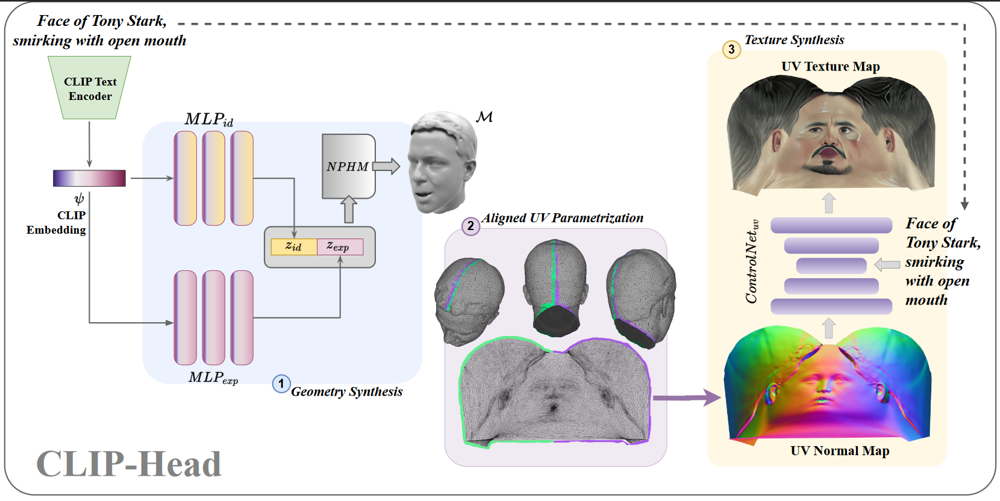

# CLIP-Head
### Official Implementation of the paper "CLIP-Head: Text-Guided Generation of Textured Neural Parametric 3D Head Models"

### [Project Page](https://raipranav384.github.io/clip_head/) | [PDF](https://raipranav384.github.io/clip_head/static/videos/Clip_Head.pdf)

## Method


### TODO

- [x] Initial Code Release
- [x] Release Checkpoints
- [ ] Release Rendering Pipeline
- [ ] Code Optimization
- [ ] Gradio demo
- [ ] Add SDXL Refiner
- [ ] Texture Synthesis with SDXL and LoRA
- [ ] Parameterization code for FLAME Head model

## Instructions

#### The code was tested on an RTX 4090 (24 GB VRAM)
- In case you face issues while building pytorch3d, try using spack to build with a different gcc version
### Step 1

```
# Clone the repo
git clone https://github.com/raipranav384/CLIP-Head.git
cd CLIP-Head


# Create a new Anaconda environment
conda create -n clip_head python=3.9

conda activate clip_head
conda install pytorch torchvision torchaudio pytorch-cuda=11.8 -c pytorch -c nvidia

# Install NPHM dependencies
cd NPHM
mkdir checkpoints
pip install -e .
cd ..

# Install other requirements
pip install -r requirements.txt

# Install PyTorch3D
pip install "git+https://github.com/facebookresearch/pytorch3d.git"
```

### Step 2 
- Download the [NPHM](https://github.com/SimonGiebenhain/NPHM) pretrained checkpoints from [here](https://drive.google.com/drive/folders/1dajUVhnYgRxbmX9CpAXDw702YYb0VHm9) and place it in ./NPHM/checkpoints
- Download checkpoints for $ControlNet_{uv}$ from [here](https://drive.google.com/file/d/1ReBlV7BX6eIbrIjYj2MV7AeLAZeP3aft/view?usp=sharing). Unzip in `./checkpoints`

### Step 3
```
python run.py --prompt "face of a man smiling with joker makeup"
```
